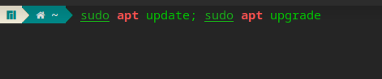
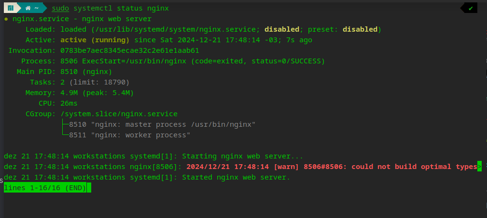
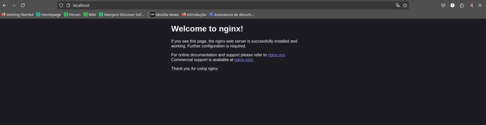
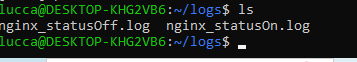
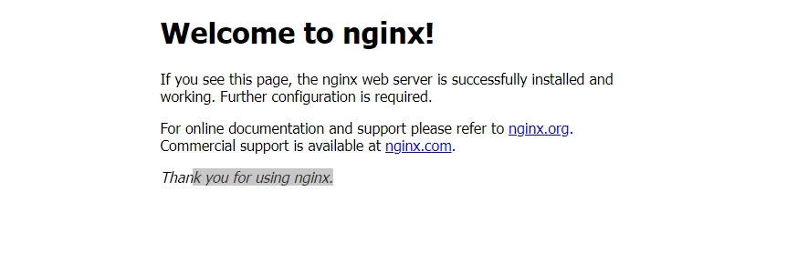

# documentação servidor nginx

## objetivos:

- Criar um servidor Nginx
- Criar um script que tenha duas saidas de logs um para status online e outro offline
- automatizar a execucao com o Cron

## requisitos do projeto

- WSL ou Linux
- Windows 10 ou superior
- ubuntu 20.04 ou superior

## atualize o sistema

antes de iniciar a instalação do nginx atualize o seu sistema para manter os pacotes atualizados.


```bash
sudo apt update
sudo apt upgrade
```



## instale o nginx

```bash
sudo apt update
sudo apt install -y nginx 
```

confira se o Nginx esta ativado com:

```bash
sudo systemctl status nginx
```



se o serviço estiver com status de desativado use:

```bash
sudo systemctl start nginx
sudo systemctl enable nginx
```

se você seguiu todos os passos corretamente, você ja consegue acessar seu servidor por [https://localhost/](https://localhost/) 



## Criação de script de validação

usaremos o cron (daemo) para agendar a execução do script.

crie dois diretorios (com nome da sua escolha), um para o script e outro para armazenar a o log do servidor do script na pasta do usuario.

```bash
mkdir shell
mkdir logs
```

crie o script na pasta shell.

```bash
cd shell
touch auto.sh
```

copie e cole dentro do script, use o nano ou outros editores de sua preferência.

```bash
sudo nano auto.sh
```

```bash

#!/bin/bash

# logs
LOG_ON="/home/$USER/logs/nginx_statusOn.log"
LOG_OFF="/home/$USER/logs/nginx_statusOff.log"
# obtendo a hora
DATA_HORA=$(date)

# Verificando o status do Nginx
STATUS=$(systemctl is-active nginx)

# checagem
if [ "$STATUS" == "active" ]; then
    echo "$DATA_HORA - | Nginx | ONLINE | servidor esta online." >> "$LOG_ON"
else
    echo "$DATA_HORA - | Nginx | OFFLINE | servidor esta offline. :(" >> "$LOG_OFF"
fi
```

Agora de permissão de execução para seu script.

```bash
sudo chmod +x auto.sh
```

## agendando execução do script no cron

agora vamos fazer agendar a execução do script a cada 5 minutos usando o cron,

o comando a seguir vai ser para adicionar a execução.

```bash
crontab -e
```

agora copia e cole dentro .

```bash
*/5 * * * * /home/lucca/shell/auto.sh
```

pode salvar e sair.

agora voce vai ter o registro de dois arquivos .log que monitaram seu servidor Nginx.



## Conclusão:

Após seguir todos os passos, você já terá um servidor funcionando com monitoramento ativo.


