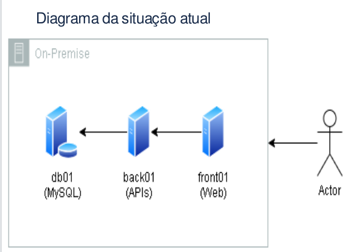
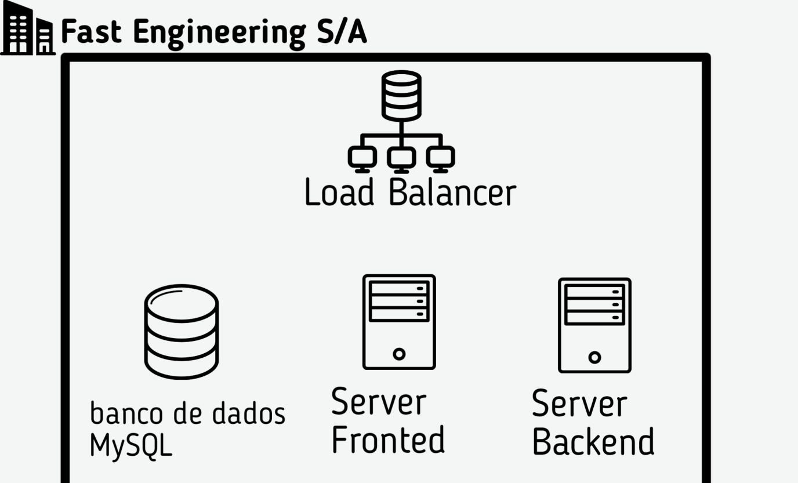
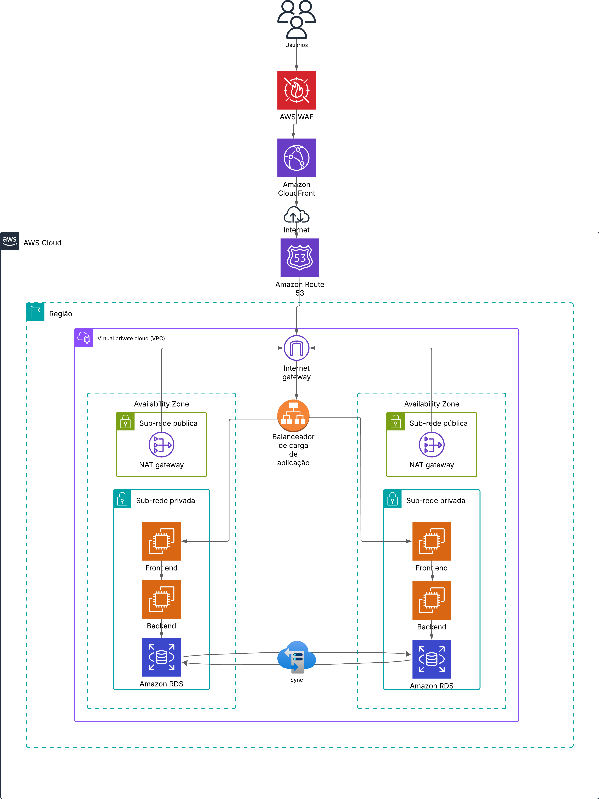

# 🚀 Projeto final.
**Desafio Final: Modernização e Migração para a AWS**

[](https://skillicons.dev)

O desafio final do programa PB propõe uma experiência prática e desafiadora para os participantes, simulando um cenário real de migração e modernização de infraestrutura na nuvem. O projeto tem como objetivo desenvolver uma solução viável para um e-commerce em expansão, que atualmente opera em servidores locais e enfrenta dificuldades para suportar o aumento da demanda.
### Principais etapas
1 - **Migração Lift-and-Shift**: Nesta fase inicial, a solução deve garantir a migração rápida da infraestrutura existente para a AWS, mantendo a operação do sistema sem grandes alterações. 


2 - **Modernização com Kubernetes**: Na segunda etapa, a proposta deve incluir uma arquitetura moderna baseada em conteinerização com Kubernetes (EKS), garantindo alta disponibilidade, escalabilidade e otimização de recursos. 

O desafio avalia a capacidade dos participantes em planejar, arquitetar e apresentar uma solução eficaz e bem fundamentada.

Essa experiência permite que os participantes consolidem seus conhecimentos em AWS, DevSecOps e arquitetura de sistemas.


### 👥 Integrantes.
- Lucca Souza.
- Francisco Leonardo.

# 💻 Case.
## Contexto.
Nós somos da empresa "Fast Engineering S/A" e
gostaríamos de uma solução dos senhores(as), que
fazem parte da empresa terceira "TI SOLUÇÕES
INCRÍVEIS".
Nosso eCommerce está crescendo e a solução
atual não está atendendo mais a alta demanda de
acessos e compras que estamos tendo.


___
### Arquitetura da FastEnginrrting.

### Servidor Front end. 

- 5GB de dados , 2Gb de e RAM 1 Core
CPU
### Servidor Back end. (Load Balancer)

- 5GB de dados, 4Gb de RAM, 2 Core CPU
### Banco de Dados.
- 500GB de dados, 10Gb de RAM, 3 Core CPU

Vistas as necessidades de migração e aumento da escalabilidade do e-commerce, projetaremos uma solução robusta, escalável e com alta disponibilidade na AWS. Ao adotarmos as boas práticas da AWS e Devops, garantiremos um crescimento escalável e sustentável para o site.


```Quais atividades necessarias para migração ? ```
---


```Quais ferramentas vão ser utilizadas ?```
---


```Qual diagrama da infraestrutura AWS ?```
---
como ficaria a migração lift-and- shift na AWS da FastEnginrrting:



*Diagrama após a migração*

```Como serão garantidos os requisitos os requisitos de segurança ?```
---

```Como será realizado o processo de backup```
---

```Qual custo da infraestrutura da AWS```
---

