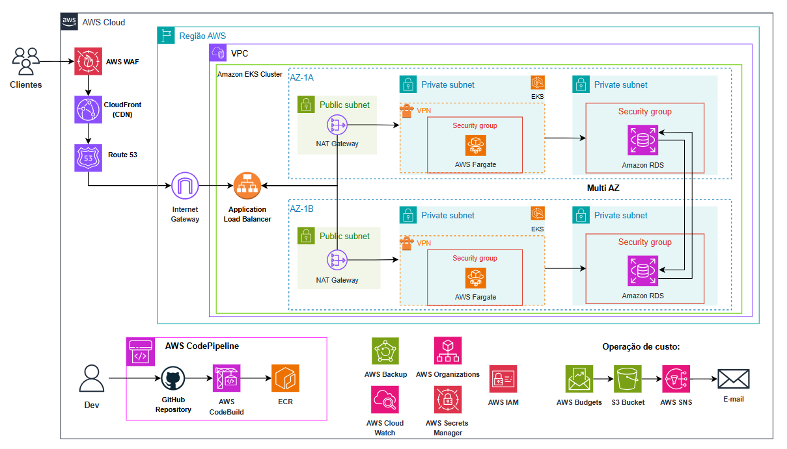
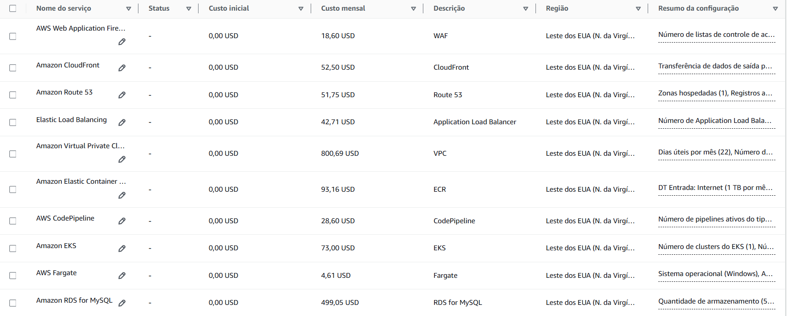
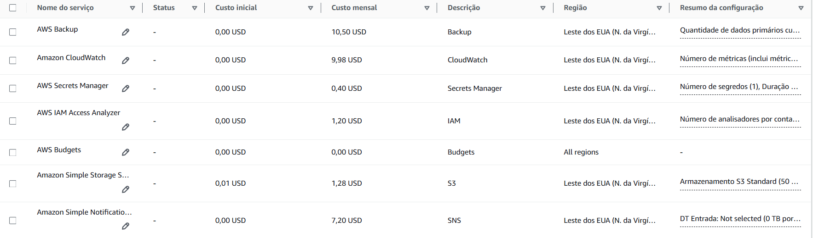

# 🚀 Projeto final.
**Desafio Final: Modernização e Migração para a AWS**

[](https://skillicons.dev)

O desafio final do programa PB propõe uma experiência prática e desafiadora para os participantes, simulando um cenário real de migração e modernização de infraestrutura na nuvem. O projeto tem como objetivo desenvolver uma solução viável para um e-commerce em expansão, que atualmente opera em servidores locais e enfrenta dificuldades para suportar o aumento da demanda.
### Principais etapas
1 - **Migração Lift-and-Shift**: Nesta fase inicial, a solução deve garantir a migração rápida da infraestrutura existente para a AWS, mantendo a operação do sistema sem grandes alterações. 


2 - **Modernização com Kubernetes**: Na segunda etapa, a proposta deve incluir uma arquitetura moderna baseada em conteinerização com Kubernetes (EKS), garantindo alta disponibilidade, escalabilidade e otimização de recursos. 

O desafio avalia a capacidade dos participantes em planejar, arquitetar e apresentar uma solução eficaz e bem fundamentada.

Essa experiência permite que os participantes consolidem seus conhecimentos em AWS, DevSecOps e arquitetura de sistemas.


### 👥 Integrantes.
- Lucca Souza.
- Francisco Leonardo.

# 💻 Case.
## Tecnologias usadas:
[](https://skillicons.dev)


## Contexto.
Nós somos da empresa "Fast Engineering S/A" e
gostaríamos de uma solução dos senhores(as), que
fazem parte da empresa terceira "TI SOLUÇÕES
INCRÍVEIS".
Nosso eCommerce está crescendo e a solução
atual não está atendendo mais a alta demanda de
acessos e compras que estamos tendo.


A FastEngineer necessita de um ambiente que siga a arquitetura atual do servidor on-premises, com o mínimo de alterações, adotando as boas práticas da AWS para torná-la mais escalável.

O servidor on-premises tem enfrentado problemas de travamentos e lentidão devido ao aumento no volume de acessos.

Após a conclusão da migração, modernizaremos a arquitetura com o objetivo de tornar o e-commerce altamente escalável, utilizando Kubernetes.
___
### Arquitetura da FastEnginrrting.

### Servidor Front end. 

- 5GB de dados , 2Gb de e RAM 1 Core
CPU
### Servidor Back end. (Load Balancer)

- 5GB de dados, 4Gb de RAM, 2 Core CPU
### Banco de Dados.
- 500GB de dados, 10Gb de RAM, 3 Core CPU

Vistas as necessidades de migração e aumento da escalabilidade do e-commerce, projetaremos uma solução robusta, escalável e com alta disponibilidade na AWS. Ao adotarmos as boas práticas da AWS e Devops, garantiremos um crescimento escalável e sustentável para o site.


```Quais atividades necessarias para migração ? ```
---
- Instalar o client do AWS MGN 
- Migrar o Banco de Dados com o AWS DMS
- Configurar o modelo de execução para as novas instâncias
- Configurar o modelo de execução para as novas instâncias
- Migrar para AWS


``` Quais ferramentas vão ser utilizadas ?```
---
<br>


```Qual diagrama da infraestrutura AWS ?```
---
como ficaria a migração lift-and- shift na AWS da FastEnginrrting:


*Diagrama após a migração*

```Como serão garantidos os requisitos os requisitos de segurança ?```
---
Os serviços AWS MGN e AWS DMS garantem a segurança dos dados principalmente por meio de criptografia:

Em trânsito: Usam TLS para proteger o tráfego de dados durante a migração.
Em repouso: Integram-se ao AWS KMS para criptografar dados armazenados.

Além disso, ambos podem ser isolados em VPCs privadas e utilizam IAM para controle de acesso.
---

```Como será realizado o processo de backup```
---
Será designado um volume EBS para manter a persistência dos dados

```Qual custo da infraestrutura da AWS```
---


## Etapa 2 - Modernização/Kubernetes

---

### `Quais atividades são necessárias para a modernização?`

**Atividades importantes para o processo de modernização**


- **Análise e avaliação da aplicação existente:** A primeira etapa foi entender a arquitetura atual, suas limitações, dependências e pontos de falha.
- **Planejamento da migração:** Foi necessário criar um plano detalhado para migração dos componentes para a nova arquitetura. Isso inclui a definição de etapas, prazos, responsabilidades, testes e recursos necessários. É fundamental definir quais serviços precisam ser migrados ou se novos serão criados.
- **Migração do sistema para containers (EKS):** Implementar o ambiente de containerização e migrar serviços para containers.
- **Implementação de arquitetura em múltiplas zonas de disponibilidade:** A construção de redundância através de duas zonas de disponibilidade (AZs) requer a replicação de serviços e a configuração de estratégias para recuperação de falhas.
- **Implementação de pipeline CI/CD:** Criar um pipeline que automatize a construção, testes, implantação e monitoramento de código, desde o desenvolvimento até a produção.
- **Integração com outros serviços AWS:** Configurar a interação com outros serviços da AWS, como bancos de dados, serviços de armazenamento, notificação e outros.
- **Otimização de performance:** A migração para a nuvem e a utilização de recursos da AWS precisa ser otimizada para performance. Isso pode envolver ajustes na configuração de cada serviço, otimização de consultas no banco de dados e escolha de recursos de melhor performance.
- **Definição e implementação de segurança:** Estender o nível de segurança para os novos serviços e a nova arquitetura.


---

### `Quais ferramentas serão utilizadas?`

| Ferramenta                                                                                                                                                                    | Descrição                                                                                                                                                                                                                                                                                                                                     |
| ----------------------------------------------------------------------------------------------------------------------------------------------------------------------------- | --------------------------------------------------------------------------------------------------------------------------------------------------------------------------------------------------------------------------------------------------------------------------------------------------------------------------------------------- |
| </img>                                                                                                                                   | **AWS CodePipeline**                                                                                                                                                                                                                 |
| </img>                                                                                                                                   | **AWS CodeBuild**                                                                                                                                                                                                            |
| </img>                                                                                                                                   | **ECR**                                                                                                                                                                                                               |
| </img>             | **AWS WAF**                                                                                                                                                                                                                                                                        |
| </img>    | **CloudFront (CDN)**                                                                                                    |
| </img>      | **Route 53** |
| </img>      | **VPC** |
| </img>                                                                                                                                    | **Internet Gateway**                                                                                                                                                                                                                                                 |
| </img>                                                                                                                                   | **NAT Gateway**                                                                                                                                                                               |
| </img>                                                                                                                                   | **Application Load Balancer**                                                                                                                                                                                                                                         |
| </img>                                                                                                                                   | **EKS**                                                                           |
| </img>                                                                                                                                   | **AWS Fargate**                                                                                                                                                                                                                                         |
| </img>                                                                                                                                   | **Amazon RDS**                                                                                                                                                                                                                                                                |
| </img>                                                                                                                                | **AWS Backup**                                                                                                                                                                                                                                                                                                     |
| </img>                                                                                                                                   | **AWS Organizations**                                                                                                                                                                                                                                                |
| </img>                                                                                                                            | **AWS CloudWatch**                                                                                                                                                                                                                                                                             |
| </img> | **AWS Secrets Manager**                                                                                                                                                                                                                                                |
| </img>                                                                                                                                   | **AWS IAM**                                                                                                                                                                                                                                                                       |
| </img>                                                                                                                                | **AWS Budgets**                                                                                                                                                                                                                                                                                       |
| </img>                                                                       | **S3 Bucket**                                                                                                                                                                                                                                                                               |
| </img>                                                                                                                                   | **AWS SNS**                                                                                                                                                                                                                                           |

---

### `Qual o diagrama da infraestrutura na AWS?`

<div align="center">



**Diagrama do ambiente na AWS após a modernização para Kubernetes**

</div>

##### Descrição


- **Clientes:** Representam os usuários finais acessando a aplicação.

- **AWS WAF (Web Application Firewall):** Fornece proteção contra ameaças e ataques à aplicação web, gerenciando o tráfego de entrada e bloqueando solicitações maliciosas.

- **CloudFront (CDN):** Um serviço de entrega de conteúdo global que reduz a latência e melhora a experiência do usuário ao distribuir o conteúdo da aplicação web globalmente.

- **Route 53:** Um serviço de DNS que gerencia as configurações de endereçamento e redirecionamento para os diferentes serviços.

- **VPC (Virtual Private Cloud):** É o ambiente virtual isolado onde toda a infraestrutura é implementada. Ele protege os recursos da internet pública.

- **Região AWS (AZ-1A e AZ-1B):** A infraestrutura é distribuída em duas zonas de disponibilidade (AZs) para redundância e tolerância a falhas. Essa redundância é fundamental para o funcionamento contínuo do sistema.

- **Internet Gateway:** A ponte entre a VPC e a internet pública para permitir o acesso externo à aplicação.

- **Application Load Balancer:** Um balanceador de carga que distribui o tráfego entre as instâncias da aplicação, melhorando a disponibilidade e o desempenho.

- **Amazon EKS Cluster:** Um cluster gerenciado de containers, baseado no Kubernetes, para executar a aplicação web. Este é um dos pontos fortes do diagrama, pois demonstra o uso de containers para escalabilidade e portabilidade.

- **Private Subnets (AZ-1A e AZ-1B):** Rede privada para proteger recursos sensíveis e evitar acessos não autorizados de fora da VPC.

- **Public Subnets (AZ-1A e AZ-1B):** Rede pública, acessível através da internet, para serviços que precisam estar expostos.

- **NAT Gateway (AZ-1A e AZ-1B):** Permite que os recursos privados dentro da VPC se conectem à internet para acesso a serviços externos, como bancos de dados.

- **Security Groups:** Controlam o tráfego de entrada e saída para os subnets e instâncias específicas, garantindo a segurança.

- **AWS Fargate:** Serviço de execução de containers sem servidor, executa serviços dentro da VPC sem a necessidade de gerenciar servidores.

- **Amazon RDS:** Serviço gerenciado de banco de dados relacional. É uma parte crucial para a aplicação web, pois armazena e gerencia os dados.

- **AWS CodePipeline:** Integração contínua e entrega contínua (CI/CD), que automatiza o processo de desenvolvimento, testes e implantação da aplicação, desde a criação do código até a implantação nos servidores.

- **Github, AWS CodeBuild, ECR:** Ferramentas usadas no pipeline CI/CD.

- **AWS Backup, AWS Organizations, AWS IAM, AWS Secrets Manager, AWS Cloud Watch:** Serviços de gerenciamento para a segurança, organização, monitoramento, e controle de acesso à infraestrutura.

- **Operação de custos (AWS Budgets, S3 Bucket, AWS SNS, Email):** Plataformas para gerenciamento de custos e envio de alertas, importantes para manter o controle financeiro das operações de nuvem.

---

### `Como serão garantidos os requisitos de Segurança?`

A arquitetura utiliza dos seguintes itens para garantir a segurança:

- **Segurança de rede:** Implementar segurança de rede em todos os níveis. Isso inclui VPNs para acessos remotos seguros, firewall, controles de acesso e segmentação de rede para isolar componentes sensíveis.
- **AWS WAF e AWS CloudFront**: Através da utilização do WAF, implementa defesas contra ameaças comuns como ataques DDoS e ataques de força bruta. E o CloudFront integrado ao WAF, ele protege aplicações distribuídas globalmente.
- **AWS Secrets Manager**: A centralização das variáveis de ambientes ou credenciais reduz o risco de vazamentos ou uso indevido, além de fazer rotação automática de segredos como senhas de bancos de dados, chaves de API e tokens de acesso seguindo.
- **AWS Organization**: A criação de contas específicas, junto ao controle de acesso e permissões do IAM, adiciona uma camada a mais de segurança, ao criar ambientes isolados, e portanto não afetam o ambiente de produção.
- **AWS IAM**:  Utilizar o AWS IAM (Identity and Access Management) para gerenciar o acesso aos recursos da AWS de forma granular e segura, restringindo permissões a apenas os usuários e serviços necessários.

---

### `Como será realizado o processo de Backup?`

- **AWS Backup**: Utilizar o AWS Backup para automatizar as tarefas de backup. Esse serviço facilita a configuração e monitoramento das estratégias de backup.
- **S3 Bucket**: Com os recursos de versionamento do S3, a empresa também podem reter várias versões de seus arquivos, permitindo reverter para versões anteriores, se necessário.
- **RDS**: O RDS sendo configurado de forma MULTI-AZ, garante uma alta disponibilidade, além de fornecer backups automáticos e snapshots manuais.

### `Qual o custo da infraestrutura na AWS?`

`Levantamento com todas as tecnologias utilizadas` ⬇️





## Resumo da Estimativa de Custo na AWS (17/03/2025)

| **Descrição**               | **Custo(USD)**| **Custo(BRL)**|
| --------------------------- | ------------- | ------------- |
| **Custo Inicial**           | 0,01 USD      | 0,06 BRL      |
| **Custo Mensal**            | 1.695,24 USD  | 9.698,30 BRL  |
| **Custo Total em 12 meses** | 20.342,89 USD | 116.379,64 BRL|
| **Inclui Custo Inicial**    | Sim           | Sim           |


**Nota**: O AWS Pricing Calculator fornece apenas uma estimativa dos custos da AWS e não inclui impostos que possam ser aplicáveis. Seus custos reais dependem de uma variedade de fatores, incluindo o uso real dos serviços da AWS.

⬇️[Link levantamento](https://calculator.aws/#/estimate?id=a0586f90dc3ebf501ac97c1b183ef7d6454df7d3)

---
